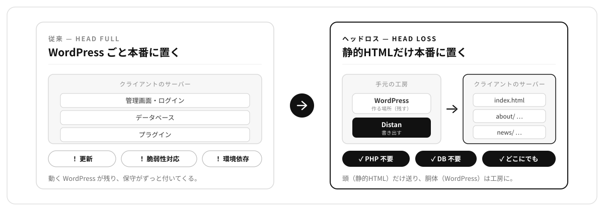

# Distan

**WordPress で作って、静的 HTML で納品する。**

Distan（ディスタン）は、WordPress を制作環境として使い、そのまま納品できる静的 HTML を書き出す WordPress プラグインです。名前は `dist/`（配布ディレクトリ）に由来します。

> **English:** Distan turns WordPress into a build environment for static HTML deliverables. You author in WordPress, then export clean, self-contained HTML that runs anywhere — no WordPress, no PHP, no database on the production server. Built for agencies that hand over HTML files rather than a CMS.



---

## 既存の静的化プラグインとの違い

既存の静的化プラグインは、**公開中の WordPress サイトを静的化する**ための道具です。WordPress が本番サーバーで運用され、その写しを速く・安全に配信します。

Distan は、**最初から静的 HTML を作るために** WordPress を使います。WordPress は制作側の環境に置かれ、公開されません。更新が必要になったら、そこで編集して再生成し、差分を納品します。

どちらも WordPress は残り続けます。違うのは、**どこに置かれ、誰が操作し、生成物が何であるか**です。

| | 一般的な静的化プラグイン | Distan |
| --- | --- | --- |
| WordPress の所在 | 本番サーバー・公開状態 | **制作側の環境・非公開** |
| 操作する人 | クライアントも更新する | 制作側のみ |
| 生成物の位置づけ | 公開中サイトの写し | **納品する成果物そのもの** |
| 公開先 | 多くは同じドメイン | **別ドメインへ納品する** |
| 更新の流れ | 編集 → 再デプロイ | 編集 → 再生成 → 差分を納品 |
| 出力 HTML | 動けばよい | **人が読める形で引き継げること** |

同じことが「できない」わけではありません。違うのは、そう使うことを想定して既定値が組まれているかどうかです。

### 制作環境は数年生きる必要があります

サイトが更新され続ける限り、その制作環境も生き続けなければなりません。ここが技術選定で効いてきます。

Astro や EJS で組んだ場合、3 年後に `npm install` が通る保証はありません。依存が消えていたり、Node のバージョンが合わなかったりします。**制作環境が動かなくなった時点で、そのサイトは更新できなくなります。**

WordPress のローカル環境は、この点で頑丈です。PHP とデータベースがあれば動き、しばらく放置しても立ち上がります。そして**社内の誰でも触れます**。Distan が「フロントエンドのツールチェーンを持ち込まない」ことにこだわるのは、初回の学習コストのためではなく、数年後にその環境が生きているためです。

---

## こんな案件のための道具です

HTML 納品の案件で、こういう困りごとはないでしょうか。

- 共通のヘッダー・フッターを JS でインクルードするのは、SEO 的にも JS 無効環境的にも避けたい。かといって全ページに実体でコピーすると、変更のたびに何十ファイルも触ることになる
- ページごとの title / description / OGP を手で書くのが面倒
- 社員インタビューや実績紹介のような**繰り返し構造のページを、手で組むのがつらい**
- Astro や EJS を導入すると、**書いた人以外が触れなくなる**。数年後に Node の依存が腐る

Distan は、これを WordPress で解決します。`get_header()` と `get_template_part()` で書けば、出力されるのは**実体の HTML**。ソースは 1 箇所、成果物は展開済み。記事投稿もメディア管理も、WordPress の管理画面がそのまま使えます。

そして納品するのは静的 HTML なので、**本番サーバーに WordPress は要りません**。

### 例: 採用サイト

用途を限定するものではありませんが、次のような条件が重なる案件では特に噛み合います。採用サイトはその典型です。

| 採用サイトによくある事情 | Distan の対応 |
| --- | --- |
| コーポレートサイトの `/recruit/` 配下に設置する。既存サイトは別ベンダー管理で、WordPress を追加で置けない | 本番に WordPress は不要。内部リンクはドキュメント相対なので設置階層を選ばない |
| 社員インタビュー 20 本、募集職種一覧、Q&A など繰り返しが多い | WordPress のループで生成。写真の差し替えもメディアライブラリで完結 |
| 情報解禁日まで検索に出したくないが、先方には見せたい | 「noindex を残す」設定でテスト公開し、本番納品時に「除去する」へ戻す |
| 毎年作り替わる（27 卒 → 28 卒）。更新は制作側が行う | 差分レポートで前回からの追加・削除を確認してから上書き納品 |

エントリーフォームは静的化できませんが、応募導線が外部 ATS へのリンクであれば影響ありません。職種の絞り込み程度であれば、静的な一覧に JavaScript を添えるだけで足ります。

### 向いていない場合

正直に書いておきます。次のような案件には向きません。

- **クライアント自身が更新する要件がある** → 素直に WordPress で納品してください
- **フォーム・検索・コメント・会員機能が必要** → 静的化すると動きません

---

## 動作要件

| 項目 | 要件 |
| --- | --- |
| WordPress | 6.0 以上 |
| PHP | 8.0 以上 |
| パーマリンク | 「基本」以外（`?p=123` は静的ファイルに対応付けられません） |
| **ループバック通信** | **自サイトへの HTTP リクエストが通ること（唯一の必須要件）** |
| 書き込み権限 | `uploads/` 配下 |
| GD または Imagick | 画像処理を使う場合のみ |
| ZipArchive | ZIP ダウンロードを使う場合のみ |

環境を問いません。Local、MAMP、XAMPP、DDEV、Docker、レンタルサーバー、どこでも動きます。DB に直接 SQL を書かず、`exec()` も外部バイナリも外部 API も使わないためです。**オフラインでも生成できます。**

**Distan が要求するのは WordPress だけです。** バンドラもトランスパイラも設定ファイルも必要ありません。Sass など制作側で使いたいツールは自由に併用できます（Distan はその存在を関知しません）。持ち込まなくていいのは、数年後に依存が腐るフロントエンドのツールチェーンのほうです。

管理画面の「環境」→「確認する」で、上記をまとめてチェックできます。

---

## インストール

管理画面からアップロードして有効化します。

1. 配布 ZIP `distan_x.y.z.zip` を用意します（[Releases](../../releases) から。まだ公開前であれば制作会社から受け取った ZIP をそのまま使えます）
2. 管理画面 → プラグイン → 新規追加 → **プラグインのアップロード**
3. ZIP を選択 → 今すぐインストール
4. 有効化

`.zip` を解凍する必要はありません。アップロードするのは `distan_x.y.z.zip`（フォルダ名 `distan/`）で、リポジトリを丸ごと固めた `distan-main.zip` ではありません。

> **開発者向け:** ソースを直接扱う場合は `wp-content/plugins/distan/` に `git clone` してください。

---

## 使い方

有効化すると、左メニューに **Distan** が追加されます。

1. **環境** — 「確認する」で必須要件を確認
2. **設定** — 公開 URL を入力（canonical と OGP にのみ使用）
3. **生成** — 「静的 HTML を書き出す」

出力先は `wp-content/uploads/distan/dist/` です。ZIP でダウンロードするか、FTP でそのままアップロードしてください。

### 設定項目

| 項目 | 説明 |
| --- | --- |
| 公開 URL | canonical と OGP にのみ使用。内部リンクはドキュメント相対なので、設置場所は選びません |
| ファイル名の形式 | `/about/index.html` または `/about.html` |
| 内部リンクの書き方 | **ドキュメント相対**（納品用）または **公開 URL で絶対**（バックアップ用） |
| 検索エンジンの扱い | noindex を除去（本番納品）または残す（テスト環境での確認） |
| WordPress の痕跡を除く | 納品用に HTML を整える |

---

## 生成されるもの

```
dist/
├── index.html
├── about/index.html
├── news/index.html
├── news/page/2/index.html      ← ページネーション
├── category/topics/index.html  ← カテゴリーアーカイブ
├── 404.html
├── assets/                     ← テーマのファイル
│   ├── css/
│   └── img/
└── media/2026/07/              ← アップロードしたファイル
```

**`wp-content/` は出力されません。** テーマは `assets/`、アップロードしたファイルは `media/` に配置されるため、納品物から WordPress の痕跡が消えます。

生成対象は、フロントページ・公開中の全シングルページ・投稿アーカイブとそのページネーション・カテゴリーアーカイブとそのページネーション・404 ページです。タグ・著者・日付アーカイブは既定では生成しません（フィルタで追加できます）。

### 除去されるもの

`generator` / RSD / WLW / 隣接投稿の rel リンク / REST API の link タグと Link ヘッダー / oEmbed / フィードの link タグ / ショートリンク / 絵文字スクリプト / リソースヒント / X-Pingback / 投機的読み込み / `sourceURL` コメント / 開発環境の `noindex`

ブロックのインライン CSS（`wp-block-*`）と `global-styles` は、レイアウトを支えているため既定では**残します**。ブロックを使わず、CSS を自分で書いている場合は、`distan_dequeue_handles` で `wp-block-library` を、`distan_remove_global_styles` で `global-styles` を落とせます。特設ページのように 1 ページだけ落としたい場合は、そのページのテンプレートに `<!-- distan:no-block-styles -->` マーカーを書いておけば、[テンプレート書き出し](#テンプレート書き出し外部コーダーへの受け渡し)のときにその雛形からだけ除去できます。

---

## 制限事項

生成方式は「サイトに通常の HTTP リクエストを投げて、返ってきた HTML を保存する」です。したがって WordPress から見て通常の表示と区別がつかず、`get_header()` も `get_template_part()` も `page-{slug}.php` も `Template Name:` テンプレートも、条件分岐も、カスタムフィールドも、すべてそのまま動きます。

動かないのは、**サーバー処理が必要なもの**だけです。

- 検索フォーム、コメント投稿、お問い合わせフォーム、会員機能
- `is_user_logged_in()` は常に `false`、`$_GET` は常に空

また、**生成時点の値で凍結されるもの**があります。

- `date( 'Y' )` によるコピーライト年
- `human_time_diff()` の「3 日前」のような相対表記
- `rand()`、`$_SERVER['HTTP_HOST']`

投稿日（`get_the_date()`）は DB の値なので安全です。相対表記ではなく絶対日付で書いてください。

### `file://` で開いた場合

生成物は ZIP を解凍してダブルクリックで開けます。ただし**ブロックテーマの ES modules（`type="module"` と importmap）は、ブラウザの CORS 仕様により `file://` では読み込めません**。Twenty Twenty-Five ではナビゲーションの開閉が動きません。

HTML・CSS・画像・フォント・ページ間リンクは動きます。完全に確認するにはローカルサーバーを使ってください。

```bash
cd dist
python3 -m http.server 8000
```

納品先は Web サーバーなので実害はありません。クラシックテーマで書けば、この問題自体が起きません。

---

## 上書き運用のための設計

Distan は「生成した HTML を FTP で本番に上書きする」運用に合わせて設計されています。想定している流れはこうです。

```
制作 → 生成 → 納品
                ↓
       更新依頼 → WordPress で編集 → 再生成 → 差分を確認 → 上書き納品
                ↑                                          ↓
                └──────────────────────────────────────────┘
```

WordPress は制作側に残り続け、更新のたびにここから生成し直します。同じ制作物から、いつでも作り直せる状態を保つのが前提です。

**キャッシュバスティングはクエリ文字列で行います。** ファイル名にハッシュを付ける方式（`style.a3f8c2.css`）は、更新のたびにファイル名が変わるため上書きできず、古いファイルが本番に残り続けます。Distan は物理ファイル名を変えず、HTML 内の参照だけ `style.css?v=...` とします。テンプレートが `filemtime()` で付けたクエリはそのまま保持されます。

**削除は報告のみです。** 出力ディレクトリは自動で掃除しますが、**本番サーバーのファイルには触れません**。前回の納品物に含まれていて今回生成されなかったファイルは、差分レポートに一覧で出ます。FTP を開く前に、この Markdown を見てください。

**リンク監査** — 生成物を走査し、リンク先のファイルが存在しないものを報告します。テーマが対象外のアーカイブへリンクしている場合や、本文中に `/wp-admin/` へのリンクが残っている場合に検出されます。自動修正はしません。

---

## テンプレート書き出し（外部コーダーへの受け渡し）

共通のヘッダー・フッターに沿った特設ページを、外部のコーダーに作ってもらう場面のための書き出しです。生成画面でページを 1 枚選ぶと、**そのページと、そのページが実際に参照するアセットだけ**（CSS・JS・フォント・画像。スタイルシートの `url()` と `@import` も辿ります）を、本番と同じ相対配置でまとめた ZIP を出します。ZIP のルートには、制作者向けの `README.md`（head・ヘッダー・フッターは触らない、本文だけ差し替える、相対パスを保つ、といった約束事）が入ります。

- **全ページ分のアセットは同梱しません。** 渡したいのは共通の見た目（ヘッダー・フッター・head）であって、他ページの画像ではないためです。参照しているものだけを、生成済みの成果物から辿って集めます。
- **本文領域を機械的に切り出すことはしません。** ページを丸ごと渡し、差し替える箇所は README で指示します。切り出しは「静かに壊れる」失敗になりがちですが、参照アセットの取りこぼしはプレビューを開けば見た目が崩れてすぐ気づけます。
- **ナビゲーションのリンク先ページは含まれません。** 1 枚だけの受け渡しなので、リンクは切れて当然です（本番では既存ページに繋がります）。

### 不要なアセットを雛形から外す

自前でテンプレートを組む場合、WordPress の既定スタイルやプラグインの JS が、使っていないのに出力に残ることがあります。テンプレートページの HTML にマーカーを書いておくと、テンプレート書き出しがその 1 枚の雛形から該当アセットを外します。Distan は中身を推測しません。テンプレートに書かれた指定にだけ従います。

- `<!-- distan:no-block-styles -->` — ブロックエディタの標準スタイルと theme.json 由来のスタイルを、この雛形から外します。`wp-block-library` の `<link>` に加え、WordPress が個別に吐く `wp-block-*` / `global-styles` 系のインライン `<style>`（`wp-block-library-inline-css` やブロックごとの `wp-block-*-inline-css`、各プレースホルダ）も対象です。画像の `sizes=auto` 用ヘルパー（`wp-img-auto-sizes-*`）のインライン `<style>` も対象です。
- `<!-- distan:drop-assets wp-includes/ wp-content/plugins/foo/ -->` — スペース区切りで書いたパスの**前方一致**で、スクリプトとスタイルシートを外します。ディレクトリ（`wp-includes/`）でもファイル単体でも指定できます。テーマのアセットは `assets/`、アップロードは `media/` に配置され、プラグインやコアのアセットは `wp-content/plugins/…`・`wp-includes/…` のまま残るので、その構造で指定します。

外したアセットは、参照している `<link>` / `<script>` タグごと雛形から取り除かれるため、リンク切れは残りません。マーカーのコメント自体も、渡す雛形からは除去されます。何を外したかは同梱の README.md に記録されます。

設定の「テンプレート書き出し」で表示を切り替えられます（既定は表示）。

---

## バックアップとして使う

WordPress で運用中のサイトの「保険」としても使えます。

1. 本番サイトをローカルに同期（All-in-One WP Migration、Duplicator、Local Connect など）
2. 内部リンクの書き方を「公開 URL で絶対」に設定
3. 生成

障害時にドキュメントルートへ丸ごと置けば、階層を気にせずそのまま表示できます。**本番サーバーに Distan を常駐させる必要はありません**（障害に備えた保険を、そのサーバーに置いても意味がないためです）。

なお、環境差で出力が変わる可能性はあります（PHP バージョン、ライセンス認証が必要なプラグイン、ドメイン制限のある外部 API など）。生成物は目視で確認してください。

---

## Markdown 書き出し（AI ツール向け）

設定で「Markdown を書き出す」を有効にすると、全ページの本文を 1 つの Markdown ファイル（`content.md`）にまとめて、出力先に書き出します。Gemini Notebook（旧NotebookLM）などの AI ツールにサイト全体を読み込ませ、内容を自然言語で質問する用途を想定しています。

- ヘッダー・ナビゲーション・フッター・サイドバー・フォームは除き、`<main>`（無ければ `<article>` や本文コンテナ）の**本文だけ**を抽出します。ページごとに見出しと URL を付けて連結します。
- 静的 HTML の生成と同じ巡回で本文を取得するため、追加のクロールは発生しません。
- サイトを更新したら再生成すると `content.md` も新しくなります。Gemini Notebook 側では、ソースを新しい `content.md` に差し替えて使います（サイト更新のたびに手動で入れ直す運用）。
- 本文の抽出範囲は `distan_markdown_region` フィルタで調整できます。
- 書き出される URL は公開 URL（サイト URL 設定）に置換されます。開発・データ管理用に、置換していない版（`content.local.md`）も出力できます（設定で選択）。

```php
// Markdown 抽出前に、本文領域から特定の要素を除くなど
add_filter( 'distan_markdown_region', function ( $html ) {
    return preg_replace( '#<div class="ad-banner">.*?</div>#is', '', $html );
} );
```

## サイトマップと robots.txt

どちらも既定はオフです。納品先で使う場合に、設定で有効にします。

**sitemap.xml** — 生成したページから標準形式の `sitemap.xml` を書き出します。Google Search Console に登録できる形式です。載るのは実際に生成したページだけで、404 は含まれません。URL は公開 URL（サイト URL 設定）、`lastmod` は投稿の更新日時です。著者・日付アーカイブは生成対象外なので、`?author=1` のような ID がサイトマップに載ることはありません。

- 除外は設定の「サイトマップから除外する（1 行に 1 つ）」で指定します。各パターンは 2 通りに照合され、`/private/` のように `/` で始めれば前方一致（そのスラッグ配下すべて）、`draft` のようにただの語なら部分一致（その語をパスに含む URL すべて）です。`distan_sitemap_exclude` フィルタでも足せます。
- 最終的なエントリは `distan_sitemap_entries` フィルタで差し替えられます。

**robots.txt** — 有効にすると、最小限の `robots.txt`（`User-agent: *` ／ `Allow: /`）を dist の直下に書き出します。sitemap.xml がオンのときだけ `Sitemap:` 行を足すので、存在しないファイルを指すことはありません。内容は `distan_robots` ／ `distan_robots_lines` フィルタで調整できます。

### コア sitemap との照合

WordPress コア（5.5 以降）自身が持つ `wp-sitemap` を基準に、列挙の取りこぼしを 2 通りの形で扱えます。

- **カバレッジ診断（自動・助言のみ）** — コアの sitemap が挙げているのに今回の生成で出力されなかった URL を、生成レポートに「コア sitemap にあって未生成のURL」として一覧します。リンクを辿るだけの列挙では拾えない、プラグインが登録したルートなどを可視化するためのものです。勝手に追加はしません（リンク監査と同じ「沈黙させず、見せる」姿勢です）。
- **列挙のシード（任意・既定オフ）** — `distan_use_core_sitemap` を有効にすると、コアの sitemap の URL を生成キューに流し込み、リンクからは辿れないページも生成対象に含めます。既定でオフなのは、コアの sitemap が noindex を含みうることと、規模が大きくなりうるためで、取り込む URL 数は `distan_sitemap_audit_max_pages`（既定 50）で上限を掛けます。

### 取りこぼしの取り込み

列挙はデータベースを読むので、プラグインが動的に登録する URL（フォームの完了画面、仮想的なルートなど）を知りません。上の照合やリンク切れレポートでその存在は見えますが、生成対象に足すには `distan_sources` フィルタを手で書く必要がありました。

生成画面の「取りこぼしの取り込み」は、この判断を URL ごとに記録します。コア sitemap にあって未生成の URL が候補として並び、それぞれを次の 3 つから選べます。

- **含める** — 次回以降の生成に追加します（`distan_sources` と同じ扱いで、カウントされ、重複排除され、差分にも出ます）。
- **今後表示しない** — 候補として二度と出しません。納品物に入れたくない内部ページなどに。
- **未決** — 今回は保留。次回もまた候補に出ます。

既定はオプトインで、選んだものだけが取り込まれます。何もしなければ何も足されないので、書き出したくない URL が勝手に混ざることはありません。選んだ判断は記憶されるので、生成のたびに選び直す必要もありません。「今後表示しない」にした URL は折りたたみの一覧から候補に戻せます。

コア sitemap にも載らない URL（リンク切れレポートで気づいたものなど）は、同じパネルの自由入力欄に 1 行 1 つで足せます。ここに書いた URL は、このサイト内のものだけが毎回の生成に含まれます。

## フィルタ

```php
// 生成するタクソノミー（既定: category）
add_filter( 'distan_taxonomies', fn() => array( 'category', 'post_tag' ) );

// アップロードファイルの出力先ディレクトリ（既定: media／空文字で平坦化しない）
add_filter( 'distan_uploads_dir', fn() => 'assets/files' );

// 生成対象から特定のページを除く
add_filter( 'distan_collect', function ( $items ) {
    return array_filter( $items, fn( $i ) => ! str_starts_with( $i['path'], 'partials/' ) );
} );

// global-styles のインライン CSS を除去する
add_filter( 'distan_remove_global_styles', '__return_true' );

// 本番 URL への追加の置換ルール（定義順に適用。長い・具体的なものを先に）
// site_url による基本のドメイン置換のあと、生成物全体（本文・JSON-LD・
// canonical・OGP を含む）に適用されます。CDN 配信のアセットや、制作環境
// 特有のパスなど、基本置換で届かない箇所の調整に。
add_filter( 'distan_url_replacements', function ( $pairs ) {
    return array(
        'https://dev.example.com/wp-content/uploads/' => 'https://cdn.example.com/',
        'https://dev.example.com/staging-only/'       => 'https://example.com/',
    );
} );
```

利用できるフィルタの一覧です。引数は先頭が対象の値で、その値を返します（真偽値フィルタは既定値の bool を返す）。

**収集（どのページを生成するか）**

| フィルタ | 引数 → 戻り値 | 既定 | 役割 |
|---|---|---|---|
| `distan_post_types` | `array $types` → `array` | 公開投稿タイプ | 静的化する投稿タイプを絞る／足す |
| `distan_taxonomies` | `array $slugs` → `array` | `['category']` | アーカイブを生成するタクソノミー |
| `distan_sources` | `array $providers` → `array` | `[]` | make_item 配列を返すコールバックを登録し、独自の URL 源を足す |
| `distan_collect` | `array $queue` → `array` | 収集済みキュー | 最終キューを直接加工（特定ページの除外など） |
| `distan_archive_max_pages` | `int $max` → `int` | 実ページ数 | 投稿アーカイブのページネーション上限 |
| `distan_term_max_pages` | `int $max, WP_Term $term` → `int` | 実ページ数 | ターム別アーカイブのページ上限 |
| `distan_404_probe` | `string $slug` → `string` | `distan-404-probe` | 404 テンプレートを引くために叩くスラッグ |
| `distan_use_core_sitemap` | `bool $enabled` → `bool` | `false` | コア sitemap の URL も収集対象に含める |

**URL とパスの書き換え**

| フィルタ | 引数 → 戻り値 | 既定 | 役割 |
|---|---|---|---|
| `distan_url_replacements` | `array $pairs` → `array` | `[]` | 生成物全体への追加の URL 置換（dev→本番・CDN 等） |
| `distan_uploads_dir` | `string $dir` → `string` | `media` | uploads の出力先ディレクトリ名（空文字で平坦化しない） |
| `distan_flatten_theme` | `bool $enabled` → `bool` | `true` | テーマアセットを `assets/` に平坦化するか |
| `distan_variant_keys` | `array $keys` → `array` | `[]` | 別ページとして扱うクエリキー（`tab`・`lang` 等） |
| `distan_query_variant_segment` | `string $segment, array $pairs, string $url` → `string` | `key-value` を `_` で連結 | バリアントの出力パス断片の作り方 |
| `distan_extra_assets` | `array $paths` → `array` | `[]` | 参照されないファイル／ディレクトリを必ず同梱（下記に詳細） |
| `distan_blocked_extensions` | `array $exts` → `array` | 実行可能拡張子 | 出力に決してコピーしない拡張子 |
| `distan_large_file_threshold` | `int $bytes` → `int` | `10MB` | 大きいファイルとして警告する閾値 |

**HTML の整形・除去**

| フィルタ | 引数 → 戻り値 | 既定 | 役割 |
|---|---|---|---|
| `distan_clean_output` | `bool $enabled` → `bool` | `true` | 整形・痕跡除去そのものの ON/OFF |
| `distan_clean_html` | `string $html` → `string` | 整形後 HTML | 書き出し直前の HTML を最終加工 |
| `distan_head_actions` | `array $actions` → `array` | 既知の head 出力 | `wp_head` から外すアクション（フック→コールバック→優先度） |
| `distan_dequeue_handles` | `array $handles` → `array` | `wp-embed` 等 | 生成時に dequeue するスクリプト／スタイルのハンドル |
| `distan_remove_global_styles` | `bool $remove` → `bool` | `false` | `global-styles` のインライン CSS を除去 |
| `distan_robots` | `array $robots` → `array` | 整形後の robots | 各ページの robots ディレクティブ |

**サイトマップ・robots.txt**

| フィルタ | 引数 → 戻り値 | 既定 | 役割 |
|---|---|---|---|
| `distan_sitemap_entries` | `array $entries, array $queue` → `array` | 生成ページ | sitemap.xml のエントリ（`loc`／`lastmod`） |
| `distan_sitemap_exclude` | `array $patterns` → `array` | 設定の除外 | sitemap から除くスラッグの前方一致／部分一致 |
| `distan_sitemap_audit_max_pages` | `int $max` → `int` | `50` | コア sitemap 照合で辿るページ上限 |
| `distan_robots_lines` | `array $lines` → `array` | 生成した行 | robots.txt の行 |

**その他**

| フィルタ | 引数 → 戻り値 | 既定 | 役割 |
|---|---|---|---|
| `distan_capability` | `string $cap` → `string` | `manage_options` | 管理画面・生成を許可する権限 |
| `distan_manifest_source` | `string $source` → `string` | `db` | 差分の基準（`db`＝前回の記録／`output`＝現物の dist） |
| `distan_markdown_region` | `string $html` → `string` | 本文領域 | Markdown 書き出し前の本文 HTML をテーマ別に調整 |
| `distan_job_stale_after` | `int $seconds` → `int` | `120` | 生成ジョブが失効とみなされるまでの秒数（低速サイト向け） |

（生成完了・デプロイの `distan_after_generate` / `distan_dispatch` は「アクション」です。[自動デプロイ](#自動デプロイ生成完了フック)を参照。）

### 参照されないファイルを含める（`distan_extra_assets`）

Distan は生成した HTML と CSS を読んでアセットを集めます。つまり **リンクや `url()` から辿れるものだけ** が生成物に入ります。裏を返すと、どこからも参照されていないファイルは取りこぼします。典型例は2つです。

- スクリプトの中で組み立てて読むファイル。`fetch('../assets/json/data.json')` のようなパスは静的解析では見えません。
- 表示には使わないソース類。`assets/scss/` のような、コンパイル前の元ファイル（本番で参照されるのは出力後の `.css` だけ）。

こうしたファイルやディレクトリを **必ず生成物に含めたい** ときは、`distan_extra_assets` フィルタに列挙します。

```php
add_filter( 'distan_extra_assets', function ( $paths ) {
    $paths[] = 'assets/json';               // ディレクトリ配下を丸ごと（再帰）
    $paths[] = 'assets/scss';               // 表示に使わないソースも一式
    $paths[] = 'assets/data/config.json';   // 単体ファイルでも可
    return $paths;
} );
```

挙動は次のとおりです。

- **ディレクトリを指定すると配下を再帰的に** 含めます。ファイル単体でも指定できます。
- 相対パスはテーマ（子テーマ→親テーマ）ディレクトリ基準で解決します。絶対パスも使えます。ただし **WordPress ルートの外は拒否** します（パストラバーサル・シンボリックリンクによる脱出を防ぐため）。
- パスは他のテーマアセットと同じく平坦化されます（テーマ配下 → `assets/`）。そのため、スクリプトからの相対 `fetch` はそのまま動きます。
- 含めたファイルはレポートに記録され、クリーンアップでも削除されません。実行可能な拡張子は拒否されます。
- **これらのファイル内の URL は書き換えません。** JSON などのデータファイルをそのまま渡す用途に向いています。
- 既定では何も足しません。ここに列挙したものだけが追加される opt-in です。

ひとつ運用上の注意です。`dist/` は納品物です。`assets/scss/` のようなソースをここに含めると、**それも本番に上がり、差分 ZIP にも入ります**。納品物をソース抜きのクリーンな状態に保ちたい場合は、ソースは Git やビルドツール側で管理し、`dist/` には混ぜない、という分け方もできます。何を含めるかは案件に応じて判断してください。

### 構造化データ（JSON-LD）について

Distan は構造化データを**生成しません**。テーマや SEO プラグイン（Yoast SEO、AIOSEO など）が出力した JSON-LD を、静的化時にそのまま保持し、内部の URL を本番 URL に置換します。構造化データを入れたい場合は、これらのプラグインで設定してください。Distan はそれを壊さず、本番向けの URL に直して書き出します。

構造化データ内の URL のうち、基本のドメイン置換（`site_url` 設定）で届かないもの（CDN 上のロゴ URL など）は、上記の `distan_url_replacements` で調整できます。制作環境が非公開・別ドメインでも、置換を前提にすることで本番向けの正しい構造化データを書き出せます。

## URL パラメータで表示が変わるページ

`/products/?filter=chair` のように、**URL のクエリパラメータで表示を出し分けている**ページも静的化できます。ただし前提が 2 つあります。

1. 素の静的ホストはパスでしか引けないので、クエリは**パスに畳み込まれます**。公開 URL は `/products/?filter=chair` ではなく `/products/filter-chair/` になります。
2. どの値・どの組み合わせを静的化するかは**あなたが宣言します**。プルダウンや複数チェックで生成される URL はページ内にリンクとして存在せず、組み合わせも無数にあり得るため、Distan は自動では発見できません（＝勝手に増やしません）。

手順は 2 つ。**表示を分けるキーを `distan_variant_keys` で宣言**し、**実際に納品する URL を `distan_sources` で登録**します。値の元はたいていタームや投稿なので、そのデータから回せば手打ちにはなりません。

```php
// 例1: 単一の絞り込み（タクソノミー1つ）ぶんを静的化する
add_filter( 'distan_variant_keys', fn( $k ) => array_merge( $k, array( 'filter' ) ) );

add_filter( 'distan_sources', function ( $providers ) {
    $providers[] = function () {
        $items = array();
        foreach ( get_terms( array( 'taxonomy' => 'product_cat', 'hide_empty' => false ) ) as $term ) {
            $items[] = array(
                'url'    => home_url( '/products/?filter=' . $term->slug ),
                'label'  => '商品一覧（' . $term->name . '）',
                'source' => array( 'kind' => 'extra', 'origin' => 'variant:filter' ),
            );
        }
        return $items;
    };
    return $providers;
} );
```

複数チェック（複数キーの組み合わせ）まで静的化したい場合は、**全直積を展開せず、実際に使う組み合わせだけ**を配列で持って回します。

```php
// 例2: 納品対象にする組み合わせだけを明示する
$combos = array(
    array( 'color' => 'red',  'size' => 'l' ),
    array( 'color' => 'red',  'size' => 'm' ),
    array( 'color' => 'blue', 'size' => 'l' ),
);

add_filter( 'distan_variant_keys', fn( $k ) => array_merge( $k, array( 'color', 'size' ) ) );

add_filter( 'distan_sources', function ( $providers ) use ( $combos ) {
    $providers[] = function () use ( $combos ) {
        return array_map( function ( $c ) {
            return array(
                'url'    => add_query_arg( $c, home_url( '/products/' ) ),
                'label'  => '商品一覧（' . implode( ' / ', $c ) . '）',
                'source' => array( 'kind' => 'extra', 'origin' => 'variant:combo' ),
            );
        }, $combos );
    };
    return $providers;
} );
```

このとき出力は `products/color-red_size-l/index.html` のようになります（キーはキー順に正規化されるので `?size=l&color=red` の順ゆらぎでも同じファイル）。宣言したキー以外のクエリ（`utm_*` など）は無視されるので、生成が意図せず膨らむことはありません。

補足:

- 内部リンクが `/products/?filter=chair` を指していれば、その `href` も畳み込み先へ自動で書き換わります。宣言したのに未登録の変種がリンクされている場合は、生成後のリンク監査に「リンク切れ（未生成）」として出るので、取りこぼしに気づけます。
- 畳み込みのディレクトリ名の形式を変えたい場合は `distan_query_variant_segment` フィルタで差し替えられます（スラッグ化など）。

## 自動デプロイ（生成完了フック）

Distan 自体はデプロイを行いません。ファイルを出力ディレクトリに書き出すだけです。ただし、生成が完了したタイミングで発火するアクションフック `distan_after_generate` を用意しています。ここに任意のデプロイ処理（git commit + push、rsync、SFTP 同期、Netlify / Cloudflare Pages のビルド Webhook など）を繋げば、「WordPress で編集 → 静的 HTML 生成 → 自動デプロイ」という流れを、**本番に WordPress を一切置かずに**組めます。デプロイ先を選ばず、Distan が認証情報を持つこともありません。

```php
/**
 * @param array  $manifest    files / added / modified / removed / broken / cleaned / finished ほか
 * @param string $output_root 出力ディレクトリの絶対パス（uploads/distan/dist）
 */
add_action( 'distan_after_generate', function ( $manifest, $output_root ) {
    // 例: 出力ディレクトリを git で commit & push（GitHub Pages / Netlify などが自動ビルド）
    $cmd = sprintf(
        'cd %s && git add -A && git commit -m "distan: %s" && git push',
        escapeshellarg( $output_root ),
        escapeshellarg( gmdate( 'Y-m-d H:i' ) )
    );
    // 実行方法は環境に合わせて（WP-Cron、シェル、CI 連携など）。
    // exec() を使う場合は環境の許可とセキュリティを必ず確認すること。
}, 10, 2 );
```

これにより WordPress を「ヘッドレス的」に使えますが、本来のヘッドレス CMS（本番で API サーバーとして動き続ける構成）とは異なり、**本番には静的 HTML しか置きません**。API サーバーすら存在しないぶん、より軽く、より安全です。

### 目視確認を挟む（デプロイフック `distan_dispatch`）

`distan_after_generate` は生成のたびに必ず発火します。リンク切れや崩れがあっても発火するため、無条件でデプロイを繋ぐと壊れた生成物をそのまま本番へ押し出しかねません。機械的なゲート（リンク切れゼロなら流す等）は繋ぐ側の条件分岐で書けますが、レイアウト崩れや文言の誤りのような「人の目でしか気づけない」確認を挟みたい場合のために、`distan_dispatch` を用意しています。

これは**手動のゲート**です。生成画面の「デプロイ」ボタン（設定で有効化）を押したときだけ発火します。承認状態は保存しません——ボタンを押す行為そのものが確認であり、記録するのは最終デプロイ時刻（`distan_last_dispatch`）だけです。

自動配信は `distan_after_generate` でプレビュー環境へ、本番への昇格は `distan_dispatch` で、という二層に分けるのが素直な使い方です。

```php
/**
 * @param array $manifest      files / added / modified / removed / broken / cleaned / finished ほか
 * @param int   $dispatched_at デプロイ時刻（Unix time）
 */
add_action( 'distan_dispatch', function ( $manifest, $dispatched_at ) {
    // 例: 目視確認済みの生成物を本番へ昇格（git push / rsync / ビルド Webhook など）
    // distan_after_generate でプレビューへ撒き、ここで本番へ、と二層に分ける。
}, 10, 2 );
```

---

## アンインストール

プラグインを削除すると、Distan が作成したオプションはすべて削除されます。**生成済みのファイルは残します**（まだ納品していない可能性があるため）。

生成物ごと削除したい場合は、`wp-config.php` に次を追加してから削除してください。

```php
define( 'DISTAN_REMOVE_FILES', true );
```

---

## ライセンス

GPL-2.0-or-later

管理画面の UI には [Alpine.js](https://alpinejs.dev/)（MIT）を同梱しています。CDN への外部通信は発生しません。
